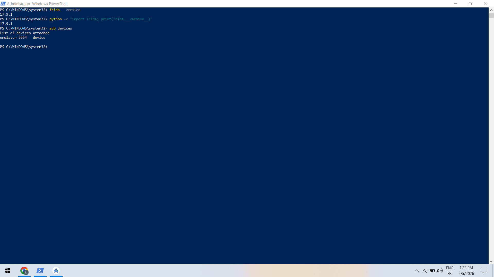
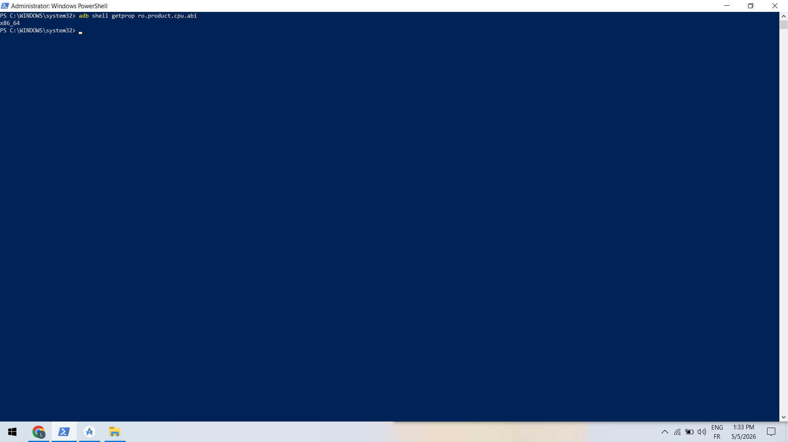
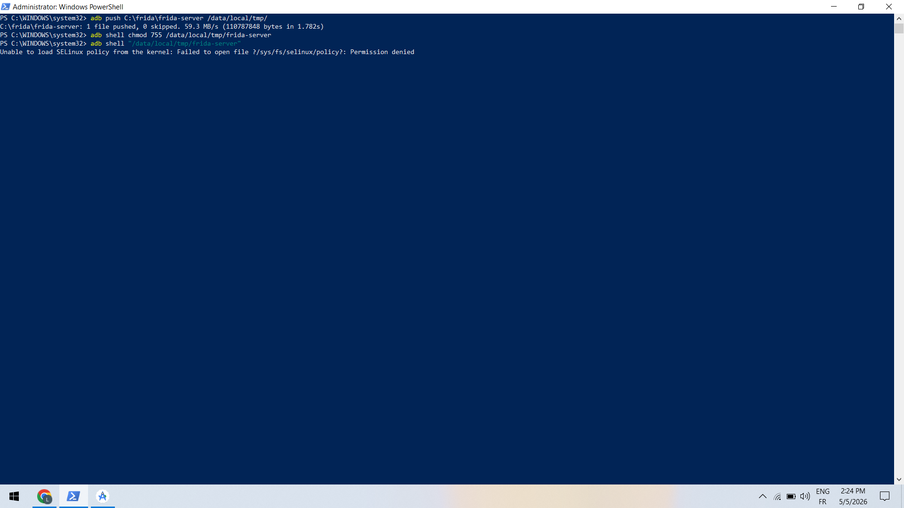
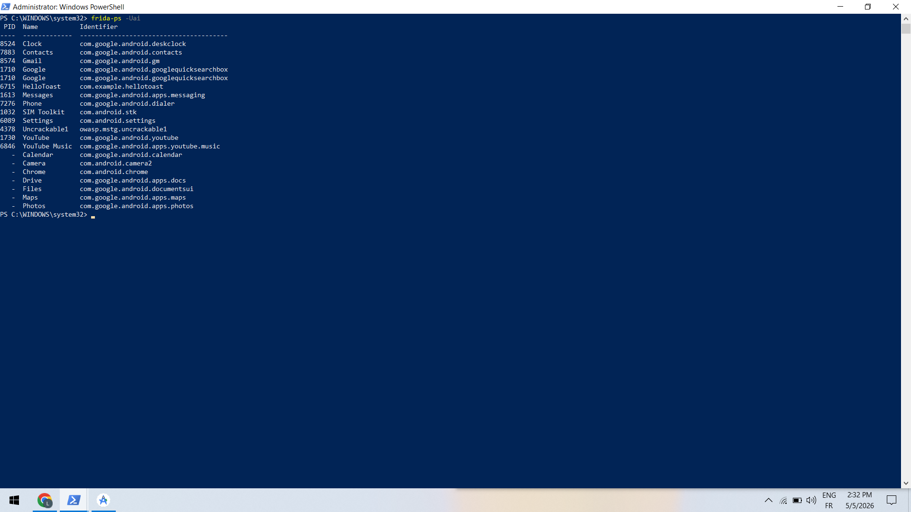
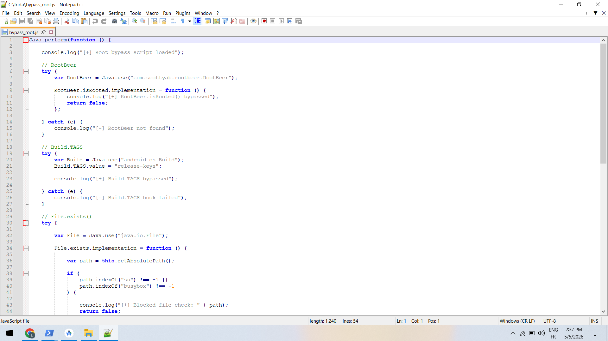
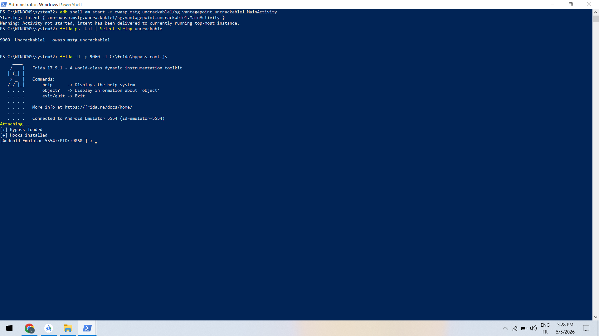
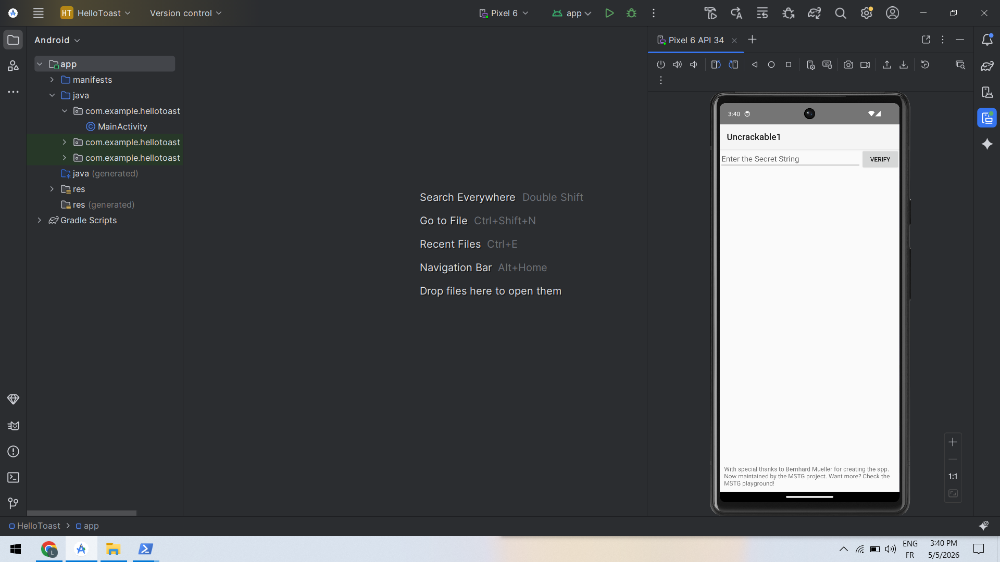
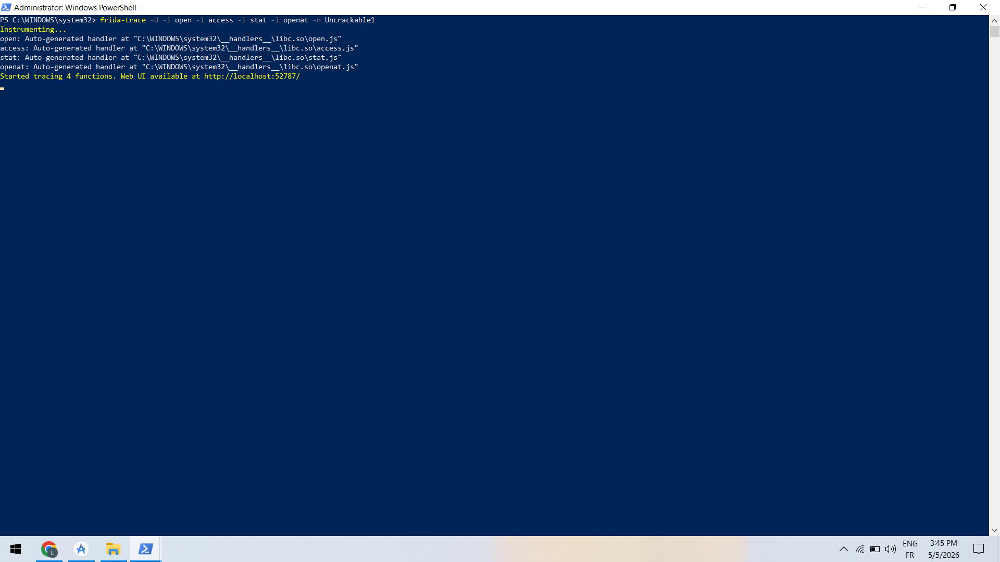

# 🔐 Lab : Bypass Root Detection avec Frida

## 🎯 Objectif

Ce lab a pour objectif de comprendre les techniques de détection de root dans les applications Android et de les contourner à l’aide de Frida (Java et natif).

---

## 📸 Capture 1 — Vérification de l’environnement Frida et connexion ADB

**Description :**
Cette capture montre la vérification de l’installation de Frida (version CLI et Python) ainsi que la connexion correcte de l’émulateur Android via la commande adb devices.

---

## 📸 Capture 2 — Identification de l’architecture Android

**Description :**
Cette étape permet d’identifier l’architecture CPU de l’appareil Android (ici `x86_64`). Cette information est essentielle pour télécharger la version correcte de `frida-server`.

---

## 📸 Capture 3 — Déploiement de frida-server

**Description :**
Le fichier `frida-server` est transféré vers l’appareil Android, puis rendu exécutable. Cette étape permet de préparer l’environnement pour l’instrumentation dynamique.

---

## 📸 Capture 4 — Vérification de la communication Frida

**Description :**
La commande `frida-ps -Uai` affiche les applications en cours d’exécution sur l’appareil. Cela confirme que Frida communique correctement avec l’émulateur.

---

## 📸 Capture 5 — Création du script Frida (bypass_root.js)

**Description :**
Création du script `bypass_root.js` contenant des hooks Java permettant de contourner les vérifications de root comme RootBeer, Build.TAGS et File.exists.

---

## 📸 Capture 6 — Injection du script Frida

**Description :**
Injection du script Frida dans l’application cible en utilisant le PID. Les messages `[+]` indiquent que les hooks sont correctement chargés.

---

## 📸 Capture 7 — Application après bypass

**Description :**
L’application UnCrackable1 s’ouvre normalement après le bypass. Les mécanismes de détection de root sont contournés avec succès.

---

## 📸 Capture 8 — Analyse des appels natifs avec frida-trace

**Description :**
Utilisation de `frida-trace` pour intercepter les appels natifs comme `open`, `access`, `stat` et `openat`. Cela permet d’analyser les vérifications de root au niveau natif.

---

## ✅ Conclusion

Ce lab a permis de :

* Comprendre les techniques de détection de root
* Utiliser Frida pour contourner ces protections
* Injecter du code Java dynamiquement
* Observer les appels natifs liés à la sécurité

L’utilisation de Frida est un outil puissant pour l’audit de sécurité des applications mobiles.

